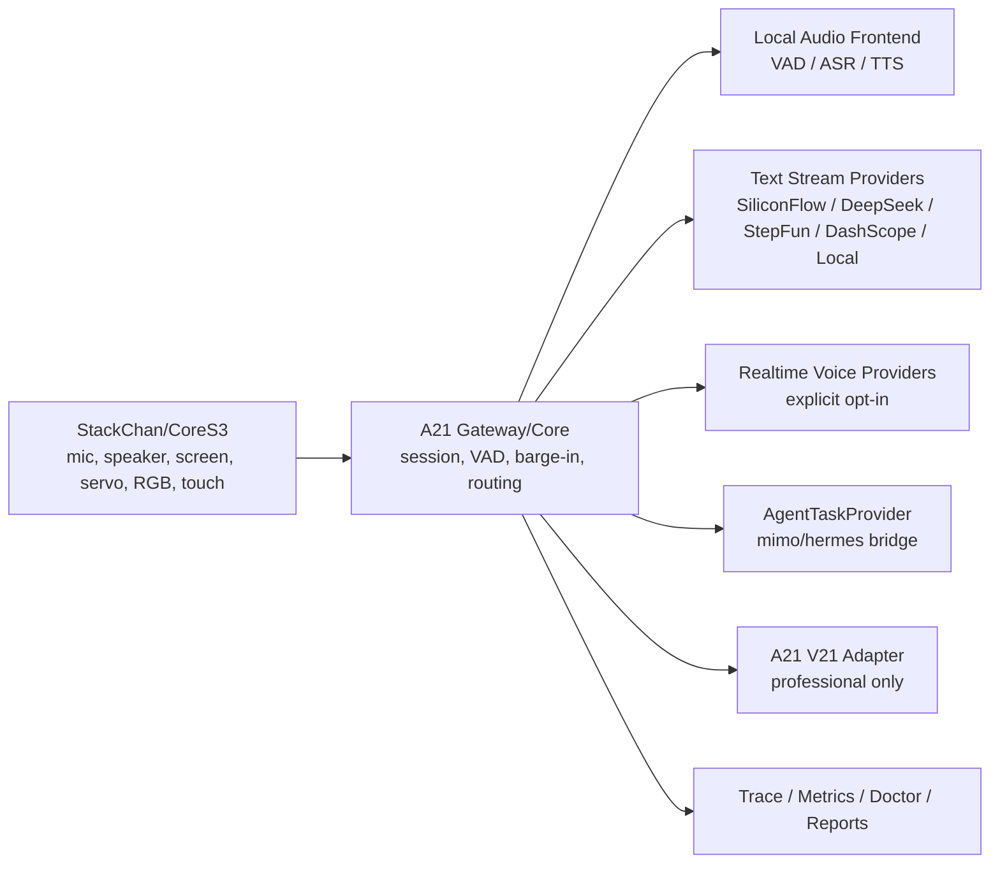

# A21 Product Requirements Document

版本：v0.4  
状态：Provider Spine / Mainland Latency Revision  
更新时间：2026-05-31  
资料来源：用户 A21 产品方向、A21 Go-first 主线、2026-05-30/31 provider 选型讨论、5080 大陆网络延迟测量、A21 外部采购/延迟实验室  
适用范围：A21 桌面实体 AI 伙计、StackChan/CoreS3 端侧、A21 Gateway/Core、Provider Spine、V21 专业知识桥接、外部延迟实验室

## 0. Context And Source Of Truth

A21 是用户主导的新项目，不是 X21/V21 的改名，也不是把 V21 包一层语音壳。外部报告、模型供应商文档、开源项目、其他 agent 输出和采购清单只能作为参考输入；A21 的产品方向、工程边界和验证节奏以用户确认过的 A21 基础为准。

本版 PRD 修正三件事：

- 以当前 A21 Go-first 主线为工程事实，不再建议 TypeScript/pnpm monorepo 重写。
- 以大陆网络实测和 5080 本地链路实测为选型依据，不再按“境内/境外”一刀切；硬门槛是大陆网络低延迟、稳定、可观测。
- 明确 Provider Spine：供应商、端到端 realtime、本地模型、mimo/hermes 类成熟 agent 都是可插拔能力，不得接管 A21 的 StackChan 语义、V21 边界、trace、隐私和固件纪律。

严禁事项：

- 不把 provider API key 写入固件、文档、报告、trace、日志、截图或 Git。
- 不在 A21 主线里混入采购工程、临时实验室、明文密钥或外部进程残留。
- 不让 StackChan 直连模型供应商或 V21。
- 不采购/接入百度、华为作为候选 provider。

## 1. Executive Summary

### Problem Statement

高压智能座舱团队在 PRD、评审、埋点、需求变更、会议纪要、竞品和跨部门沟通中长期处在碎片化压力里。普通语音助手和聊天机器人要么没有实体在场感，要么延迟和打断体验不成立，要么无法在“陪伴/嘴替”和“证据型专业分析”之间保持清晰边界。

### Proposed Solution

A21 是基于 StackChan/CoreS3 的桌面实体 AI 伙计。它用低延迟语音、表情、屏幕、舵机、RGB、触摸和语义状态提供工位陪伴、情绪承接、共创整理和办公室小剧场；当用户显式进入专业模式时，通过 A21 Gateway 调用 V21 adapter，切换为可引用、可追溯、可观测的证据型产品副驾。

工程上，A21 采用“本地语音前端 + 热插拔云/本地 provider + 专业 V21 adapter”的编排：

```text
StackChan thin device
  -> A21 Gateway/Core
  -> local VAD/ASR/TTS and/or provider adapters
  -> V21 adapter only for professional mode
  -> observability and safety boundaries across every turn
```

### Success Criteria

- 体验成立：用户能明确感知 A21 是“在场的桌面伙计”，不是屏幕播放器、AI 音箱或客服 bot。
- 陪伴首响：本地语音前端 + 流式文本 provider + 本地/流式 TTS 的首段可听响应 P50 < 900ms，P95 < 1500ms；未达标 provider 不进主链路。
- 打断成立：用户插话后，本地播放、嘴型、speaking 状态停止 P95 < 300ms，并记录 provider cancel / playback stop trace。
- 专业模式成立：用户触发专业模式后 1200ms 内给出“我在查”的语音或屏幕反馈；最终输出包含结论、证据、置信度和后续追问。
- 热插拔成立：新增 OpenAI-compatible 文本 provider 不需要改 Gateway 业务逻辑，只需新增 profile/env/smoke；realtime voice 和 agent provider 通过独立 lane 接入。
- 安全成立：所有 provider key 只存在本地/服务器 env 或 secret manager；报告和 Git 中不得出现明文 key。

## 2. User Experience & Functionality

### User Personas

**Primary User：智能座舱产品经理**

工作环境包含上海办公室、家中开发环境、局域网硬件调试和高压跨部门协同。核心需求不是“多一个助手”，而是有一个能听懂混乱、帮忙翻译成可用语言、必要时切到证据模式的桌面同事。

**Secondary User：座舱团队成员**

包括研发、测试、交互、数据和项目协同人员。A21 在公共模式下必须克制，不外放个人疲惫、敏感业务资料或对具体同事的攻击性评价。

**Builder：用户自己**

用户需要 A21 可本地调试、可回滚、可观测、可替换 provider、可在 5080 大陆网络机器上做外部实验，并最终把结论干净回传到 A21 主线。

### Product Identity

A21 是“桌面实体 AI 伙计”。它不是普通语音助手、恋爱模拟器、心理治疗师、客服机器人、纯效率助手、纯搜索框、V21 voice shell 或只会卖萌的玩具。

核心气质：

- 亲近，但不粘人。
- 聪明，但不装。
- 可爱，但不幼稚。
- 专业，但不冷。
- 会吐槽，但不刻薄。
- 会安慰，但不鸡汤。
- 能帮用户把烦躁翻译成可执行语言。

### Core Modes

| Mode | 目标 | 典型触发 | 输出形态 |
| --- | --- | --- | --- |
| `dialogue` | 默认低延迟对话态 | 开机、空闲、吐槽、共创、日常办公表达 | 短语音、眼神、呼吸感、轻反馈、可打断整理 |
| `professional` | 证据型专业模式 | “专业模式”“给我证据” | V21 检索、结论、证据卡片、置信度 |

Legacy labels such as `workmate`, `companion`, `co_creation`, and `roleplay`
are compatibility aliases for `dialogue`, not separate launch modes. Privacy,
focus, public/private visibility, local fallback, and error remain state or
policy fields, not extra product modes.

### User Stories

**Story 1：低压陪伴**

As a 高压产品经理, I want A21 能先听我把混乱的话说完, so that 我不用先组织好语言才能开始解决问题。

Acceptance Criteria:

- A21 在 idle/listening/thinking/speaking/interrupted/error/local_fallback 之间有明确表情和语音状态。
- 用户停顿时 A21 不抢答；只在阈值后给短 backchannel。
- 用户表达情绪时，不输出客服腔、鸡汤腔或过度亲密回应。
- 网络或 provider 失败时，A21 给出诚实、本地化、有角色感的降级反馈。

**Story 2：工位嘴替**

As a 用户, I want 把情绪话转换成会议上能说的话, so that 我能表达真实问题而不把沟通搞炸。

Acceptance Criteria:

- 输入：“这个需求烦死了，边界根本没定，还让我出方案。”
- 输出应转成：“这轮我们需要先确认目标和非目标，否则方案会持续扩张，研发成本和验收标准都不可控。”
- 输出可直接用于飞书、会议、PRD 或评审。
- A21 不丢掉真实痛点，但去掉攻击性和情绪爆点。

**Story 3：自然打断**

As a 用户, I want 在 A21 说话时直接插话, so that 对话像同事交流，而不是排队听播报。

Acceptance Criteria:

- A21 speaking 时设备继续监听或进入可打断半双工策略。
- 检测到用户语音后 300ms 内停止本地播放、嘴型和 speaking 状态。
- Gateway 向当前 provider lane 发起 cancel/truncate/session reset 等取消动作。
- trace 中记录 `barge_in_detected_ms`、`provider_cancel_ms`、`playback_stop_ms`。

**Story 4：专业模式**

As a 用户, I want A21 能从陪伴态切到证据态, so that 我能用自然语音查询 V21 的专业知识。

Acceptance Criteria:

- 触发语包括“专业模式”“认真查一下”“帮我查 V21”“给我证据”。
- 进入仪式明确：“进入专业模式。情绪先放旁边，现在只看证据。”
- 屏幕显示 PRO / V21 adapter / 检索中。
- 返回 `fast_answer`、`confidence`、`evidence`、`speech_blocks`、`screen_cards`、`follow_ups`。
- 公共模式下不得外放敏感证据内容。

**Story 5：开发者可修复**

As a Builder, I want 每次失败都能定位到具体层, so that A21 可以长期迭代，而不是每次靠猜。

Acceptance Criteria:

- `go run ./cmd/a21 doctor` 能检查身份、端口、代理、局域网、V21 adapter、provider readiness、metrics、trace。
- provider smoke 报告只记录 env 名、host、状态、耗时，不记录 key、模型值、完整 URL、prompt 正文或 proxy URL。
- 所有新服务、目录、日志、端口、环境变量都使用 `a21` / `A21_` 命名空间。
- A21 与 X21/V21 的命名、进程、端口、环境变量、日志和固件产物隔离。

### Non-Goals

- 不做通用 AI 音箱。
- 不做心理治疗师、医疗建议产品或恋爱模拟器。
- 不把 V21 改造成 A21 内部模块。
- 不让 StackChan 直接访问 provider 或保存 API key。
- 第一阶段不把 mimo/hermes 这类成熟 agent 放进实时首响路径。
- 第一阶段不追求复杂长期记忆；所有记忆写入必须明确确认、显示范围、支持删除。
- 不因为“境外模型”直接排除，也不因为“国内厂商”直接通过；大陆网络低延迟和稳定性是硬门槛。

## 3. AI System Requirements

### Provider Orchestration Lanes

A21 必须把 provider 能力拆成 lane，而不是用一个“万能主脑”接管所有路径。

| Lane | 目标 | 推荐编排 | 当前优先级 |
| --- | --- | --- | --- |
| `dialogue` | 低延迟自然对话主链 | 本地 VAD/ASR -> 流式文本 provider -> 流式 TTS -> stock Xiaozhi Opus | P0 |
| `realtime_voice` | 端到端 speech-to-speech | provider realtime session，显式 opt-in | P1 |
| `professional` | 证据型专业模式 | V21 adapter -> 证据/置信度 -> TTS/readout | P0 |
| `local_fallback` | 网络坏时仍可回应 | 本地 VAD/ASR/TTS + Ollama/llama.cpp/vLLM | P0 |
| `agent_task` | 长任务、工具、规划 | mimo/hermes 等成熟 agent bridge | P1 |

默认实时主链路：

```text
StackChan mic
  -> A21 Gateway VAD/barge-in
  -> local ASR
  -> OpenAI-compatible streaming text provider
  -> local/streaming TTS
  -> StackChan speaker/screen/servo/RGB/touch state
```

端到端 realtime voice 是单独能力，不替代专业模式，也不默认接管 A21。只有通过明确的 runtime opt-in、fixture smoke、延迟报告和物理设备验收后，才能进入受控测试。

### Mainland Latency Selection Policy

5080 大陆网络实验结论修正 provider 选型：

- 本地 ONNX CPU VAD/ASR/TTS 推理已经足够快，语音前端不应默认外包给云。
- 云端 provider 的关键指标是 `first_content_ms`、p95/p99、冷启动、错误率，而不是宣传模型能力。
- SiliconFlow、DeepSeek、StepFun、DashScope、Moonshot、Volcengine Ark 等都应通过同一套 lab 探针重复测试。
- SiliconFlow / DeepSeek 优先进入流式文本主备实验；StepFun 低延迟潜力强，但 p95 长尾必须守门；DashScope 适合作为阿里生态备选；Moonshot 更适合非实时/长上下文备选；Volcengine Ark 因冷启动暂不进实时主链路。
- OpenAI 大陆直连实时链路不作为默认；除非有可验证的低延迟合规网络方案。
- 百度、华为不进入候选池。

采购原则：

- 先买小额度测试，不买大包。
- 只有连续多时段 p95 达标且错误率可控，才进入 A21 主链路候选。
- 任何报告和 JSONL 不得包含 key；key 只通过本地 env/secret manager 注入。

### Provider Spine Requirements

Provider 是资源，不是架构中心。A21 需要一个热插拔 Provider Spine：

```go
type ProviderFamily string

const (
	ProviderFamilyTextStream    ProviderFamily = "text_stream"
	ProviderFamilyVoiceRealtime ProviderFamily = "voice_realtime"
	ProviderFamilyVoiceHybrid   ProviderFamily = "voice_hybrid"
	ProviderFamilyAgentTask     ProviderFamily = "agent_task"
	ProviderFamilyLocalAudio    ProviderFamily = "local_audio"
)

type ProviderProfile struct {
	Name           string
	Label          string
	Family         ProviderFamily
	Protocol       string
	Capabilities   []string
	RequiredEnv    []string
	APIKeyEnv      string
	ModelEnv       string
	BaseURLEnv     string
	DefaultBaseURL string
	EndpointPath   string
	RouteEligible  bool
}
```

内置 profile 应覆盖：

- `siliconflow`
- `deepseek`
- `stepfun`
- `bailian_dashscope`
- `moonshot`
- `volcengine_ark`
- `local_ollama`
- `local_vllm`
- existing realtime references: `openai_realtime`, `doubao_realtime`, `doubao_tts_realtime`
- future agent bridge references: `hermes_agent`, `mimo_agent`

Profile 规则：

- profile 不得包含 key 值，只能引用 `A21_` env 名。
- profile 名称、env、capability 不得含 X21/V21 污染，V21 只能出现在 adapter 专属上下文。
- `A21_PROVIDER_PROFILES_PATH` 可加载本地 profile 覆盖，但必须做 secret/legacy/provider-blocklist 校验。
- doctor 和 smoke 输出只显示 env 名、host、状态、耗时。

### Text Stream Provider Requirements

第一实现切片应优先做通用 OpenAI-compatible 文本流式 provider：

```go
type TextStreamRequest struct {
	TraceID   string
	SessionID string
	Mode      string
	Messages  []TextMessage
	MaxTokens int
}

type TextStreamEvent struct {
	Kind     string // text_delta, reasoning_delta, done, error
	Text     string
	Final    bool
	Usage    *ProviderUsage
	TimingMS *ProviderTiming
}
```

Streaming parser 必须支持：

- OpenAI-style `delta.content`
- StepFun-style `delta.reasoning`
- `[DONE]`
- non-2xx redacted failure
- first byte、first content、total duration metrics

### Realtime Voice Requirements

Realtime voice provider 必须走 A21 provider-neutral session，不允许把供应商事件直接穿透给 Gateway 或 firmware。

要求：

- 明确 session lifecycle。
- 支持 audio uplink / audio downlink / transcript / state event。
- 支持 barge-in cancel/truncate。
- 支持 fixture smoke，不默认做真实网络调用。
- 物理 StackChan 必须通过 `realtime_on_next_speech` 一次性 arm 后才允许启动付费 realtime provider。
- professional mode 不走 opaque realtime 主链路。

### Agent Bridge Requirements

mimo/hermes 类成熟 agent 作为后台 `AgentTaskProvider`，不进入实时首响路径。

```go
type AgentTaskRequest struct {
	TraceID   string
	SessionID string
	Task      string
	Context   map[string]string
}

type AgentTaskEvent struct {
	Kind  string // started, progress, text_delta, tool_call_redacted, result, error
	Text  string
	Final bool
}
```

规则：

- Agent 只接收 task/context，不接管 StackChan control。
- Agent 不能直接写 firmware command、V21 internals、provider env、Gateway runtime state。
- Agent 输出必须由 A21 Core/Gateway 转成 A21 semantic event。
- Agent bridge 默认 disabled，需显式 `A21_AGENT_PROVIDER_PRIMARY` 和独立 smoke。

### Evaluation Strategy

**Latency Evaluation**

- VAD open/close P50/P95。
- ASR first partial/final P50/P95。
- Text provider first byte / first content / total P50/P95/P99。
- TTS first audio / complete audio P50/P95。
- Downlink first frame / device playback start P50/P95。
- Barge-in stop/cancel P50/P95。

**Conversation Quality Evaluation**

- 人格一致：不客服腔、不鸡汤、不越界亲密。
- 办公室语境：理解 PRD、埋点、评审、研发反问、老板追问。
- 共创质量：能把混乱情绪拆成问题、目标、非目标、风险、下一步。
- 失败体验：失败时仍像可靠桌面伙计，而不是程序崩溃。

**Professional Mode Evaluation**

- Evidence precision >= 95%。
- 低置信度时显式表达不确定并提出补充查询。
- 公共模式不得外放敏感业务证据。
- 每个答案可回溯 trace_id、source_id 和 V21 query。

## 4. Technical Specifications

### Architecture Overview

当前批准方向是 Go-first A21 spine。StackChan 是感知与表达端；A21 Gateway/Core 是唯一实时中枢；Provider Spine 负责热插拔供应商/本地模型/agent；V21 只通过 adapter 进入专业模式。



### Component Responsibilities

**StackChan Firmware**

- Wi-Fi/LAN Gateway 连接。
- 麦克风采集和音频帧上行。
- 音频播放、播放停止、缓冲清理。
- 表情、屏幕、舵机、RGB、触摸语义事件。
- 本地 fallback 表情和短提示。
- 硬件安全 clamp、队列、插值、保护。

StackChan 禁止：

- 保存 provider API key。
- 直接访问 provider、V21、外部代理。
- 处理复杂 RAG、长期记忆、provider routing 或 agent planning。

**A21 Gateway/Core**

- Session/trace/device state。
- VAD、barge-in、jitter/buffer。
- Provider Spine 和 lane routing。
- V21 adapter client。
- Expression/semantic state orchestration。
- Proxy/network policy。
- Device registry。
- Structured logs、metrics、trace、doctor。

**External Mainland Latency Lab**

- 位于 A21 项目外。
- 负责 5080 机器上的 provider 网络测试、本地模型基线、JSONL 结果、采购采集。
- 不写入 A21 主线，不携带明文 key 入 Git。
- 只把脱敏结论和必要 profile/env 名回传给 A21。

**V21 Adapter**

- 接收 professional mode query。
- 返回 fast_answer、confidence、evidence、speech_blocks、screen_cards、follow_ups。
- 不读取陪伴模式隐私。
- 不让 A21 假设 V21 的 chunk、embedding、rerank 或数据库实现。

### Current Approved Repository Direction

A21 当前主线以 Go 模块和 `cmd/a21` CLI 为基础，不重写成 TypeScript monorepo。

默认命令：

```bash
make verify
go run ./cmd/a21 preflight
go run ./cmd/a21 doctor
go run ./cmd/a21 provider-smoke --provider deepseek
go run ./cmd/a21 provider-realtime-plan
```

新增 provider 相关改动必须：

- 遵循 `internal/providers` 现有 contract/factory/smoke/realtime pattern。
- 保持 Gateway 默认 mock；只有显式 `A21_GATEWAY_VOICE_PROVIDER=selected` 才允许 selected provider 进入 runtime。
- 新 env 写入 engineering docs。
- 新报告写入 `reports/`，并保持 redaction。
- 不触碰 firmware 上传/打包路径，除非任务就是 firmware，并通过独立 worktree。

### Protocol And Trace

设备消息必须携带或准备携带：

```text
trace_id
session_id
device_id
kind
seq
sent_at_ms
payload
```

Provider 事件进入 Gateway 前必须转换为 A21 provider-neutral event，不允许供应商事件穿透到 firmware。Professional evidence 必须保留显式 evidence/card 字段，不得伪装成普通聊天文本。

### Ports And Naming

端口和命名沿用 A21 主线文档。原则：

- 新端口必须写入 `docs/engineering/NETWORK.md` 的端口登记区。
- 新进程必须以 `a21-` 开头。
- 新 env 必须以 `A21_` 开头。
- A21 不得误用 X21/V21 端口。
- V21 只能作为 adapter target 出现。

### Proxy And Network Policy

Gateway/Core 是唯一公网/provider 出口。StackChan、localhost、LAN、`.local`、V21 local adapter 必须直连，不得静默继承全局代理。

Gateway 连接位置是独立产品配置。前端必须能在 `mac_local` 与
`public_wss` Gateway profile 间选择: `public_wss` 是配置公网 URL 后的
主产品 Gateway，正式产品用于公网 `443` / 可信 `wss` StackChan 接入；
IP-only bring-up 可临时使用 `http/ws`；`mac_local` 保持 Mac Gateway 对本地模型
和本地处理的极速能力，作为前端/operator 可切换路径。公网控制面展示
`mac_local` 时必须支持通过 `A21_MAC_LOCAL_GATEWAY_URL` 配置真实 Mac/local
WebSocket 地址；未配置时才回退到请求主机。这个选择不得变成第三个
product mode，也不得改变
`dialogue` / `professional` 的职责边界。

Provider HTTP/WebSocket client 必须：

- 默认 direct，不继承 ambient proxy。
- 只有 `A21_PROVIDER_PROXY_URL` 设置时使用显式 provider egress proxy。
- doctor 只报告 proxy env 名和 mode，不报告 proxy 值。

### Observability

每轮对话至少记录：

```text
trace_id
session_id
device_id
mode
network_profile
proxy_profile
audio_capture_started
audio_uplink_first_frame_ms
gateway_received_first_audio_ms
vad_start_ms
vad_end_ms
asr_first_partial_ms
asr_final_ms
provider_first_byte_ms
provider_first_content_ms
tts_first_audio_ms
audio_downlink_first_frame_ms
device_playback_start_ms
first_audio_total_ms
barge_in_detected_ms
provider_cancel_ms
playback_stop_ms
fallback_used
error_code
```

Metrics 至少覆盖：

```text
a21_session_total
a21_audio_uplink_ms_bucket
a21_first_audio_ms_bucket
a21_vad_duration_ms_bucket
a21_asr_first_partial_ms_bucket
a21_provider_first_content_ms_bucket
a21_tts_first_audio_ms_bucket
a21_v21_query_ms_bucket
a21_barge_in_total
a21_barge_in_stop_ms_bucket
a21_provider_error_total
a21_provider_failover_total
a21_proxy_misconfig_total
a21_device_disconnect_total
a21_fallback_total
```

### Security & Privacy

- Provider API key 只存在 Gateway/Core runtime env、operator secret storage 或未来 secret manager。
- 明文 key 不得进入 PRD、reports、logs、trace、firmware、PlatformIO build flags、Git。
- V21 专业资料不得在公共模式下外放。
- 陪伴吐槽不得自动进入 V21 query 上下文。
- 私密模式内容不得作为专业检索上下文，除非用户显式确认。
- 原始音频默认不持久化：`A21_RECORD_RAW_AUDIO=false`。
- 长期记忆必须确认保存、显示范围、支持删除。

## 5. Risks & Roadmap

### Technical Risks

| Risk | Impact | Mitigation |
| --- | --- | --- |
| provider p50 很快但 p95 长尾不可控 | 语音体验突然卡死 | p95/p99 和错误率守门，不只看均值 |
| 端到端 realtime provider 黑盒化 | 专业模式不可审计 | realtime 只走陪伴 lane，professional 必须走 V21 adapter |
| agent 框架抢控制权 | A21 语义/隐私/延迟边界失控 | mimo/hermes 只做 AgentTaskProvider 后台桥接 |
| 本地模型实验污染 A21 主线 | 主线不稳定、key 泄露 | 5080 lab 独立目录，脱敏结果回传 |
| 中国大陆网络/代理污染 | StackChan/Gateway/V21 连接异常 | doctor 检查 proxy/no_proxy/LAN/provider network mode |
| 供应商 API 变化 | adapter 失效 | profile 化、smoke 化、fixture test |
| 角色过度亲密或鸡汤 | 产品气质偏离 | personality constitution + scenario playbook + 人工样例评审 |
| 证据错误或 hallucination | 专业模式不可信 | evidence precision eval、低置信度显式表达 |
| 固件错误刷写 | 硬件不可用 | firmware build/upload/package 继续严格隔离 |

### Phased Rollout

**Phase 0：A21 Go-first 地基和隔离纪律**

验收：

- `make verify`、`preflight`、`doctor` 可运行。
- A21/X21/V21 命名、端口、env、固件产物隔离。
- Gateway 默认 mock，不静默接入真实 provider。

**Phase 1：Provider Spine / Text Stream Hot Plug**

交付：

- Provider profile registry。
- OpenAI-compatible text stream provider。
- Streaming parser：`delta.content`、`delta.reasoning`、`[DONE]`。
- `provider-smoke --stream --repeat` 红线脱敏报告。
- Built-in profiles：SiliconFlow、DeepSeek、StepFun、DashScope、Moonshot、Ark、local_ollama、local_vllm。

验收：

- 新 provider 不改 Gateway 业务逻辑即可进入 smoke。
- 报告不泄露 key、model value、prompt、proxy URL。
- 失败 provider 可 fallback 到第二 provider，并记录 trace/metrics。

**Phase 2：Fast Companion Hybrid Lane**

交付：

- 本地 VAD/ASR/TTS adapter boundary。
- Text stream provider router。
- 本地 TTS first-audio 计时。
- A21 personality short-response prompt。

验收：

- 本地语音前端 + SiliconFlow/DeepSeek 流式文本 + 本地 TTS 跑通实验链路。
- 首段可听响应记录 P50/P95。
- barge-in 能取消当前 provider/text/TTS/playback。

**Phase 3：Realtime Voice Controlled Lane**

交付：

- Realtime provider fixture smoke。
- End-to-end speech-to-speech provider profile。
- Physical StackChan one-shot arm：`realtime_on_next_speech`。
- Realtime downlink event mapping to A21 `VoiceEvent`。

验收：

- 未 arm 的物理 StackChan 不会启动付费 provider。
- arm 后只启动一次，trace 中可见 provider session start/audio commit/first downlink/cancel。
- professional mode 被 realtime boundary 明确拒绝。

**Phase 4：V21 Professional Mode**

交付：

- A21 V21 adapter client。
- professional intent/router。
- evidence/speech_blocks/screen_cards/follow_ups。
- V21 timeout fallback。

验收：

- 触发专业模式后切 PRO。
- 1200ms 内给“我在查”的反馈。
- 返回证据卡片，不把证据伪装成普通聊天。

**Phase 5：AgentTaskProvider Bridge**

交付：

- AgentTaskProvider interface。
- Hermes/MiMo bridge profile。
- Fake SSE/HTTP/stdio bridge smoke。
- agent output to A21 semantic event mapper。

验收：

- Agent bridge 不进入首响路径。
- Agent 不能直接操作 firmware、provider env、V21 internals 或 Gateway runtime state。
- Agent 长任务有 progress/result/error 事件和 trace。

**Phase 6：低延迟、物理验收与产品打磨**

交付：

- latency bench for real provider/local chain。
- StackChan microphone/speaker/touch/servo/RGB acceptance evidence。
- public/private/focus transitions。
- roleplay/co_creation playbooks。
- failure copy polish。

验收：

- 真实 provider first content、TTS first audio、device playback start、barge-in stop 均有报告。
- 用户愿意对 A21 说非任务型内容，也能自然切专业模式。

## 6. Test Plan

### Unit Tests

必须覆盖：

- Provider profile registry：built-ins、override、env 名、URL、blocklist、legacy pollution。
- Text stream parser：`delta.content`、`delta.reasoning`、`[DONE]`、non-2xx、timeout。
- Redaction：key、Authorization、model value、prompt、proxy URL 不出现在 stdout/report/log。
- Provider router：primary fail -> fallback success。
- Mode transitions：professional 不进 realtime；local_fallback 有明确状态。
- Barge-in controller：playback stop + provider cancel + state transition。

### Integration Tests

必须覆盖：

- `provider-smoke --provider deepseek --execute` redacted report。
- `provider-smoke --provider bailian_dashscope --execute` redacted report。
- future `provider-smoke --provider siliconflow --stream --repeat` with httptest fake。
- Gateway selected provider requires explicit `A21_GATEWAY_VOICE_PROVIDER=selected`。
- Physical StackChan unarmed audio suppresses realtime provider start。
- Agent bridge fake stream produces background task events only。

### Firmware Tests

必须覆盖：

- A21 identity and protocol parse。
- audio frame byte size validation。
- playback chunk parse and buffer clear。
- servo clamp。
- touch semantic event。
- no provider secret/build flag leakage。

### Latency Bench

外部 lab 和 A21 主线都应能产生 JSONL/JSON 报告，字段至少包含：

- provider name / profile。
- network mode。
- first byte / first content / total。
- VAD/ASR/TTS first event。
- error type。
- p50/p95/p99。
- cold/warm marker。

## 7. CI And Local Verification

当前 A21 主线默认验证：

```bash
make verify
go run ./cmd/a21 preflight
go run ./cmd/a21 doctor
go test ./internal/providers ./internal/gateway ./internal/app
```

Provider 相关新增命令应遵循：

```bash
go run ./cmd/a21 provider-smoke --provider deepseek
go run ./cmd/a21 provider-smoke --provider deepseek --execute --output-dir reports
go run ./cmd/a21 provider-realtime-plan
go run ./cmd/a21 provider-realtime-fixture --provider openai_realtime --execute
```

PR 不能合入，除非：

- Go tests pass。
- `make verify` pass。
- `git diff --check` pass。
- no forbidden namespace。
- ports/env docs updated。
- new runtime path has metrics/traces。
- provider report redaction tests pass。

## 8. Copywriting And Personality Requirements

人格不应写死在一个巨大 prompt 中。必须拆成：

```text
core_identity.md
tone_rules.md
mode_prompts/
  workmate.md
  companion.md
  co_creation.md
  roleplay.md
  professional.md
  focus.md
  public.md
  private.md
  failure.md
scenario_playbooks/
  pre_meeting.md
  post_meeting.md
  boss_challenge.md
  engineer_pushback.md
  user_complaint.md
  desk_mouthpiece.md
  late_night_radio.md
```

禁止客服腔：

- “请问有什么可以帮您？”
- “我理解你的感受，你已经很棒了。”
- “让我们一起积极面对挑战。”

推荐同事感：

- “你不用先组织好语言。先说，我在。”
- “你不是不清楚，是被几个问题同时压住了。”
- “这个会上别这么说，会炸。我帮你换个版本。”
- “你现在不像缺答案，像是脑子太满了。”
- “进入专业模式。情绪先放旁边，现在只看证据。”
- “我现在连不上外部大脑，但我还在。你可以继续说，我先记下来。”

## 9. Open Questions

- SiliconFlow / DeepSeek / StepFun / DashScope 的最终付费额度和 rate limit 怎么限制，避免实验期费用失控？
- 本地 ASR/TTS 的质量评测样本集如何收集：是否使用真实办公室口语、噪声、多说话人样本？
- A21 首个本地 TTS 主链路选 sherpa-onnx、CosyVoice，还是 provider streaming TTS？
- Realtime voice lane 先接哪家：DashScope Qwen-Omni、StepFun realtime、Doubao S2S，还是继续只保留 fixture？
- Agent bridge 中 mimo/hermes 的具体形态是 HTTP、SSE、stdio 还是 MCP？
- 长期记忆是否进入 v1；若进入，保存范围、删除入口和审计日志如何设计？

## 10. Source-Backed Design Notes

### Mainland Latency And Local Model Lab

2026-05-30 的 5080 大陆网络测量显示，本地 ONNX CPU VAD/ASR/TTS 推理已经足够快，云端 provider 的关键差异主要落在 first content、p95 长尾、冷启动和错误率。设计结论：A21 不应做“全 API 语音机器人”，而应优先做“本地语音前端 + 云端流式文本/可选 TTS + 本地兜底”。

### StackChan/CoreS3 Hardware

StackChan/CoreS3 的硬件基础支持麦克风、扬声器、屏幕、触摸、RGB、舵机和 Wi-Fi。设计结论：StackChan 用于在场感、表达和传感；Gateway/Core 负责 provider、V21、网络、代理、观测和复杂状态。

### Realtime Voice And Barge-In

端到端 realtime voice 能提供自然首响和拟人交互，但专业模式不可依赖 opaque speech-to-speech 黑盒。设计结论：realtime voice 是独立 lane；陪伴可以用它，专业必须保留 V21 证据链和文本中间态。

### Mature Agent Frameworks

mimo/hermes 类成熟 agent 可以用于工具调用、长任务、规划、后台自动化和复杂 agent 能力，但不能接管 StackChan 实时语音编排。设计结论：它们作为 `AgentTaskProvider` 桥接进 A21，输出被 A21 重新映射为语义事件。

### Observability

任何语音延迟都必须可定位。A21 从 provider spine 设计阶段就要记录 trace_id/session_id/device_id、first byte、first content、first audio、barge-in、cancel、fallback 和 provider failover，否则后续无法判断是本地、网络、provider、V21、播放还是设备问题。

## 11. Final Acceptance Questions

每个阶段都必须回到以下五问：

1. 用户第一次看到它，会不会觉得它像一个在场的小东西，而不是屏幕播放器？
2. 用户烦的时候，会不会愿意对它说一句真话？
3. 用户说完混乱想法后，它能不能帮用户变清楚一点？
4. 用户进入“专业模式”后，它能不能明显从陪伴态切到证据态？
5. 它失败时，是不是仍然像一个可靠的桌面伙计，而不是一个崩溃的程序？

如果答案是否定的，不管代码多漂亮，都不算 A21 成立。
